# Vulnerability Scanner Lab | Declan Worley
## Objective
To gain hands-on experience with Nessus and VMWare, demonstrating vulnerability detection, scan interpretation, and remediation of vulnerabilities on networked systems.

- **Systems Utilized:** Windows 10 Pro, Kali Linux
 

## Task 1) Making Windows More Vulnerable

We will be adding vulnerabilities to the Windows 10 system, including turning off security updates, uninstalling any existing updates, and turning off the firewall. This is crucial so that Nessus can accurately identify any vulnerabilities present.

  
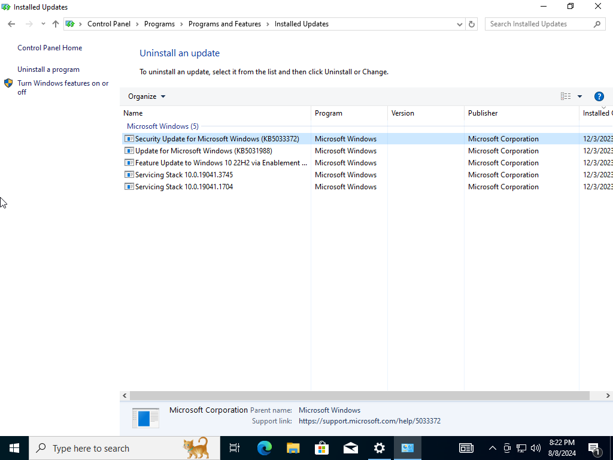
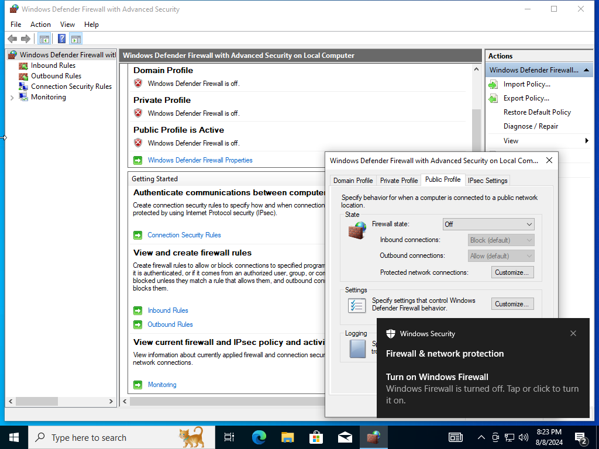

## Task 2) Installing Nessus

We can download Nessus from the Tenable site. Once downloaded to the Kali machine, we can install it using the command:  `sudo dpkg -i Nessus-10.8.1-ubuntu1604_amd64.deb`. We can then access it through the browser dashboard by navigating to https://localhost:8834/  
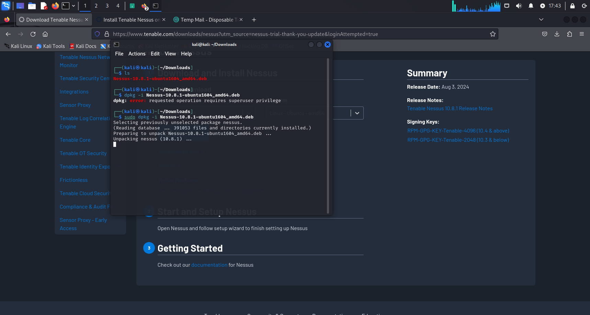

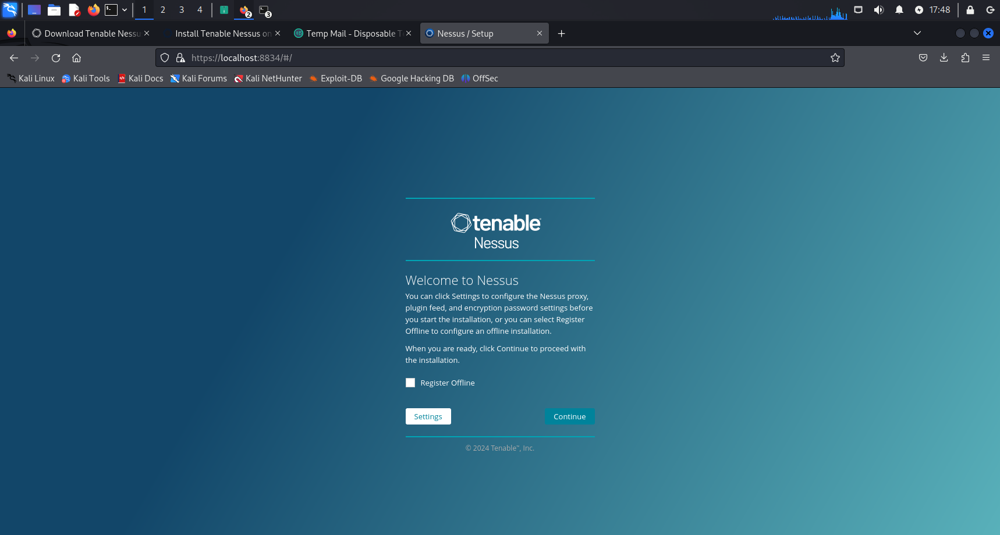

## Task 3) Scanning using Nessus

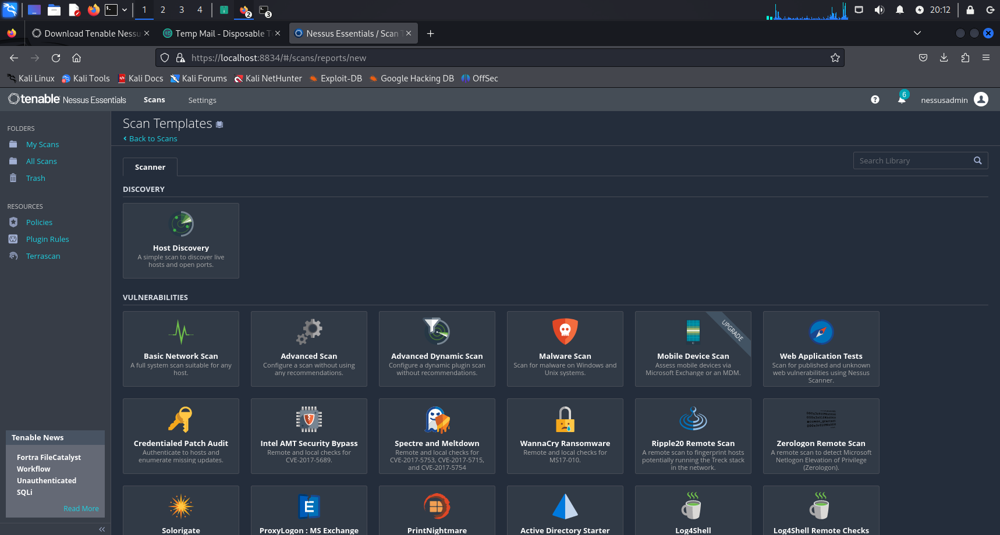  

Several scanning options were explored, including:

- Basic Network Scan - Identifies open ports, running services, and potential vulnerabilities. Helps in hardening the network by mitigating identified risks.
- Malware Scan - Detects known malware signatures and suspicious activities, aiding in malware removal or any potentially unwanted programs.
- WannaCry Ransomware -  Scans for indicators of the WannaCry ransomware, which first appeared in May 2017, leveraging known vulnerabilities in Windows systems and encrypts your data, and asks for payment in exchange for encryption key.
- Log4Shell Scan - Identifies potential threats related to the Log4Shell vulnerability in Apache log4j, a critical concern for system integrity. Discovered in December, 2021, the Log4Shell vulnerability affects the commonly used Apache log4 logging library. This vulnerability can be used by attackers to execute arbitrary code remotely, which can completely compromise the system. Running this scan often can help you to protect your network from this critical vulnerability.

We will start off with a Basic Network Scan. We will name our scan BasicScanWindows, and give it the target IP of our Windows host. There are many other basic options for your scan as well, such as scheduling the scan for later and email notifications. Under discovery, we will use "Port Scan (common ports)", which will scan for the most common ports such as Telnet, SSH, FTP, SMTP, and a myriad of others. Assessment allows you to configure the scanner on how it performs the scan and what types of vulnerabilities to look out for. Report allows us to choose the level of detail of our scans. And lastly, the Advanced tab allows us to choose the amount of hosts to scan.

Other options include performing a Credentialed scan and Plugins. Credentialed scans can allow us to get information about our systems such as software patch levels and configurations, which can be critical to detect vulnerabilities. The Plugins page allows us to choose plugins to assess different types of vulnerabilities and risk within our network. The Nessus plugin library is of considerable size, and is constantly updated to keep up with the latest threats and vulnerabilities.

Now that our scan is saved, we can run this scan on our Windows host by clicking the launch icon on the right.  

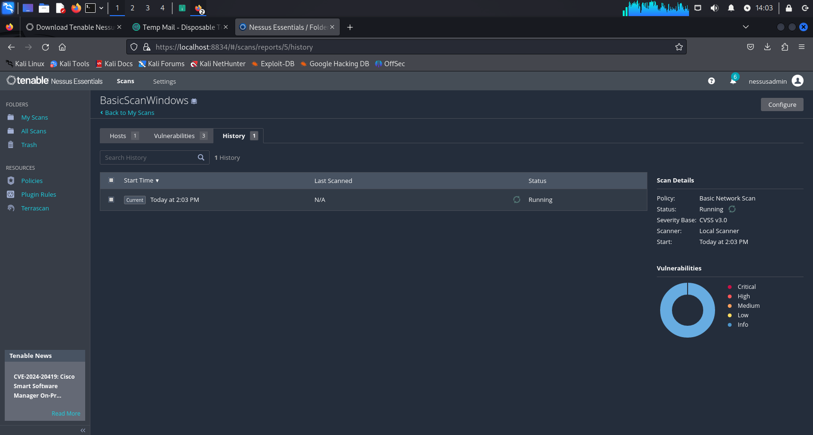  
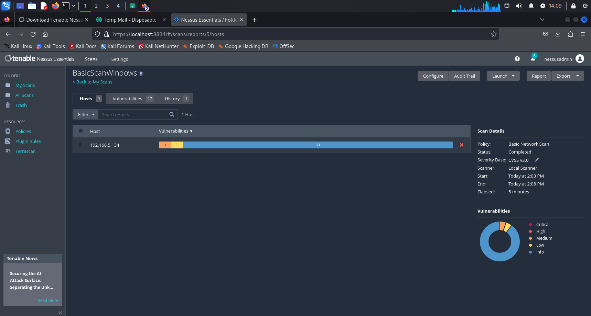  
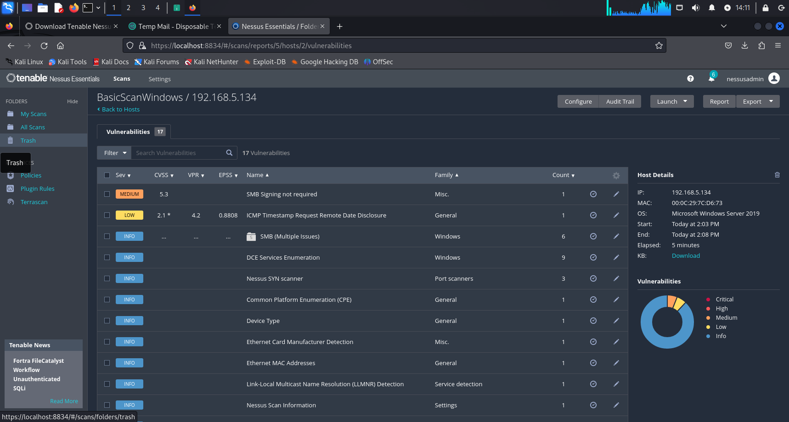  
Upon finishing the scan, Nessus lists the vulnerabilities found and categorizes them based on criticality. Here, we can see that most of our scans were of info importance, which can provide useful information such as ports open or services running that may or may not pose an immediate risk.  
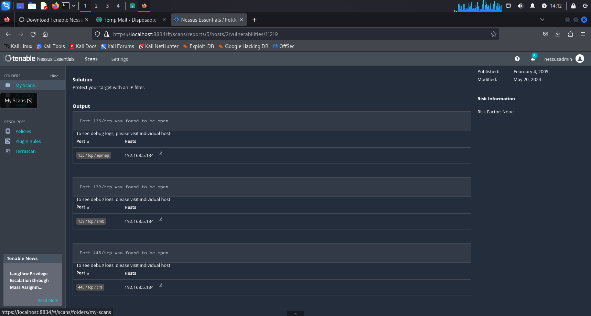  
We can see that it found ports 135, 139, and 445 open. 445 being one that is used by attackers to propagate the WannaCry Ransomware on the network, so it is important to review these as well, after prioritizing the higher priority vulnerabilities.

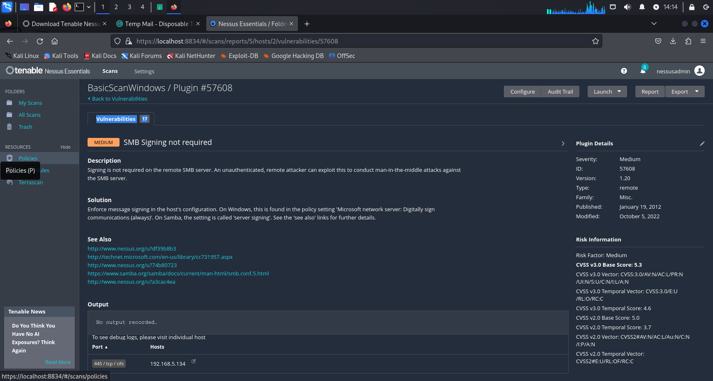  
Our highest level risk vulnerability that was found with this scan is the "SMB Signing not required" vulnerability. The dashboard has an explanation of the following:  
"Signing is not required on the remote SMB server. An unauthenticated, remote attacker can exploit this to conduct man-in-the-middle attacks against the SMB server." Furthermore, it gives us a solution to patch this vulnerability by enforcing message signing in the host's configuration, and gives more detail and documentation for Windows and Samba. This is one example of how Nessus can help us to find and remediate vulnerabilities on our network.

## Task 4) Credentialed Scan

We will now configure our BasicScanWindows scan to perform a credentialed scan.  
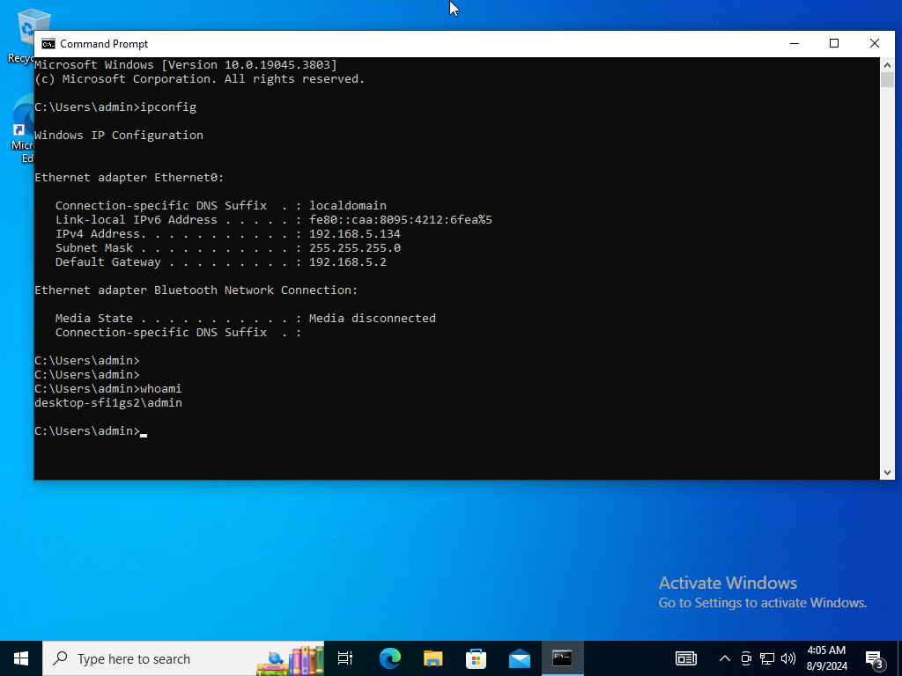  
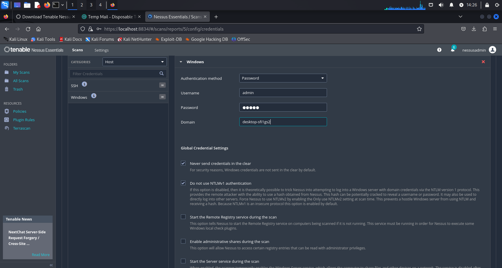

We need to change our Remote Registry service to automatic instead of disabled, which will allow us to remotely connect and view the system registry database, and registry keys and values. In "User Account Control", we will also set the notifications to never pop up, so that our scan will not be interrupted by user control prompts.  
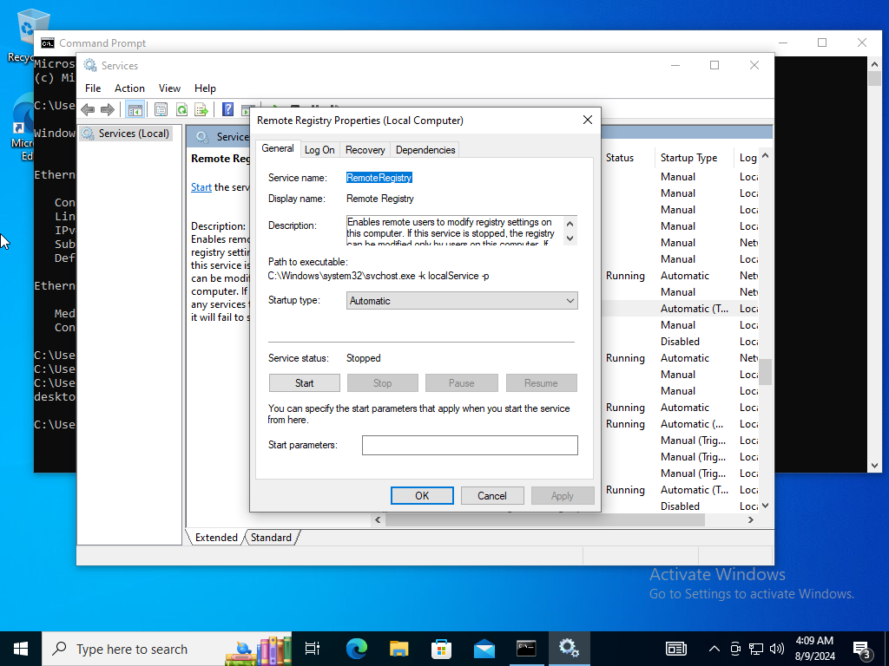  
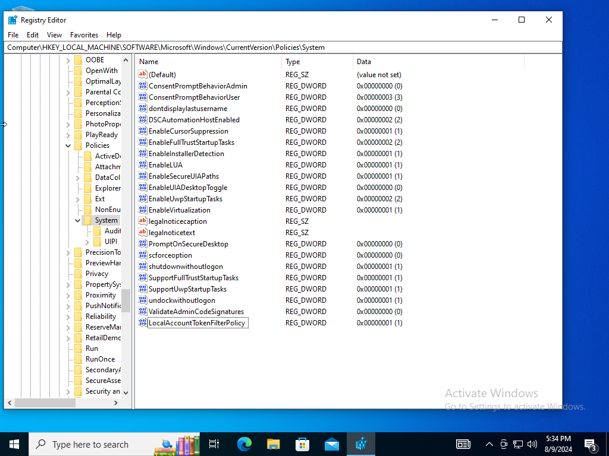

We will also create new registry DWORD value "LocalAccountTokenFilterPolicy" and set it to 1. What this achieves is allowing non-administrator accounts to access admininstrator resources while using remote procedure calls. With all of these settings in place, we can now launch a credentialed scan on our Windows host.

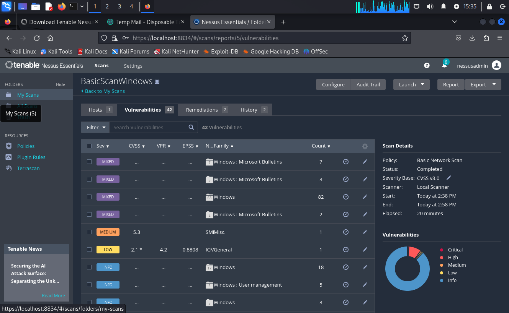  
The results of the scans show us 42 vulnerabilities, a considerable amount more than before. Also, previously, the highest category was medium, now we have critical and high level vulnerabilities detected. One of the critical vulnerabilities is *KB5037768: Windows 10 Version 21H2 / Windows 10 Version 22H2 Security Update (May 2024)* meaning we are missing security update 5037768 on our Windows host, which opens it up to many listed vulnerabilities:

- Windows MSHTML Platform Security Feature Bypass Vulnerability (CVE-2024-30040)
    
- Windows Common Log File System Driver Elevation of Privilege Vulnerability (CVE-2024-29996, CVE-2024-30025, CVE-2024-30037)
    
- Windows Mobile Broadband Driver Remote Code Execution Vulnerability (CVE-2024-29997, CVE-2024-29998, CVE-2024-29999, CVE-2024-30000, CVE-2024-30001, CVE-2024-30002, CVE-2024-30003, CVE-2024-30004, CVE-2024-30005, CVE-2024-30012, CVE-2024-30021)
    

To remediate this vulnerability we can start by installing KB5040427, a more recent security update, and also install the recent security updates for the Microsoft .NET Framework.

Our machine is pretty bare as it is, with only Windows, adding software to the host can lead to introducing more vulnerabilities as well. To demonstrate this, outdated software will be installed onto the host, and a new scan will be carried out to detect for new vulnerabilities that may have been introduced.

### Vulnerable (Outdated) software installed:

- 7-Zip 19.0 (2019-12-19)
- Minecraft Server 1.18.1 (2021-12-10)
- VLC Player 3.0.10 (2020-05-20)
- Google Chrome 60.0.3112.78 (2020-04-29)

Scanning our machine now gives us 46 vulnerabilities in Nessus, an even greater amount since the last scan. And, as you've guessed it, we have a number of new vulnerabilities introduced since we've only installed these programs.

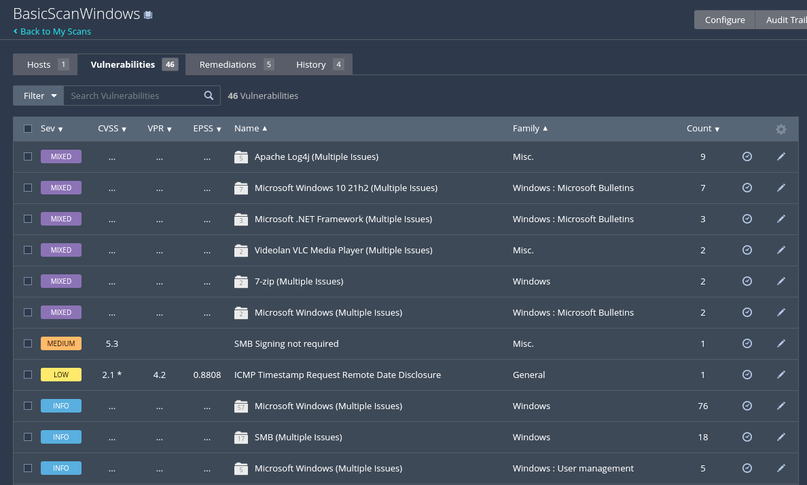

  
We have detected multiple vulnerabilities of CVSS 9.8, almost the maximum score, on versions before VLC 3.0.20:

- Videolan VLC prior to version 3.0.20 contains an incorrect offset read that leads to a Heap-Based Buffer Overflow in function GetPacket() and results in a memory corruption. (CVE-2023-47359)
    
- Videolan VLC prior to version 3.0.20 contains an Integer underflow that leads to an incorrect packet length. (CVE-2023-47360)
    

Our installation of 7-Zip also was detected to have multiple vulnerabilities:

- A remote code execution vulnerability exists in 7-zip due to an integer underflow. An unauthenticated, remote attacker can exploit this, by tricking a user into opening a specially crafted archive, to execute arbitrary code on the system. (CVE-2023-31102)
    
- A remote code execution vulnerability exists in 7-zip due to an out-of-bounds write. An unauthenticated, remote attacker can exploit this, by tricking a user into opening a specially crafted archive, to execute arbitrary code on the system. (CVE-2023-40481)  
    
    

The downloaded Minecraft server, which isn't even running, has also allowed Nessus to detect the following vulnerabilities. There is a CVSS 10 vulnerability regarding possible remote code execution leveraging the Log4j library used by the Minecraft server. It is crucial that you get to remediating this vulnerability as soon as possible.

We can also generate a report using Nessus, either for all vulnerabilities or smaller selections of vulnerabilities. This can allow you to share the reports with your developers to make changes to remediate the vulnerabilities. The report that I have generated is placed in this repository to check out.

## Task 5) Remediation

Now that we know of the vulnerabilities present on our network, or host in this case, the next step is to remediate the vulnerabilities to mitigate risk of attack. To achieve this, we can:

- Update **Windows**
- Enable **Windows Firewall** (Ports 445, 139, 135)
- Remove or Update **Google Chrome**
- Remove or Update **Minecraft Server**
- Remove or Update **7-Zip**
- Remove or Update **VLC Media Player**

For this lab, we will delete the Minecraft server folder, uninstall VLC Media Player, and update the remaining programs to the most recent versions. The Recycle Bin will also be emptied to further remove any trace of the Log4j library from Minecraft, as well as remove any installers we have leftover. After updating our vulnerable software, we will restart to ensure that the patches from Windows has been successfully installed.

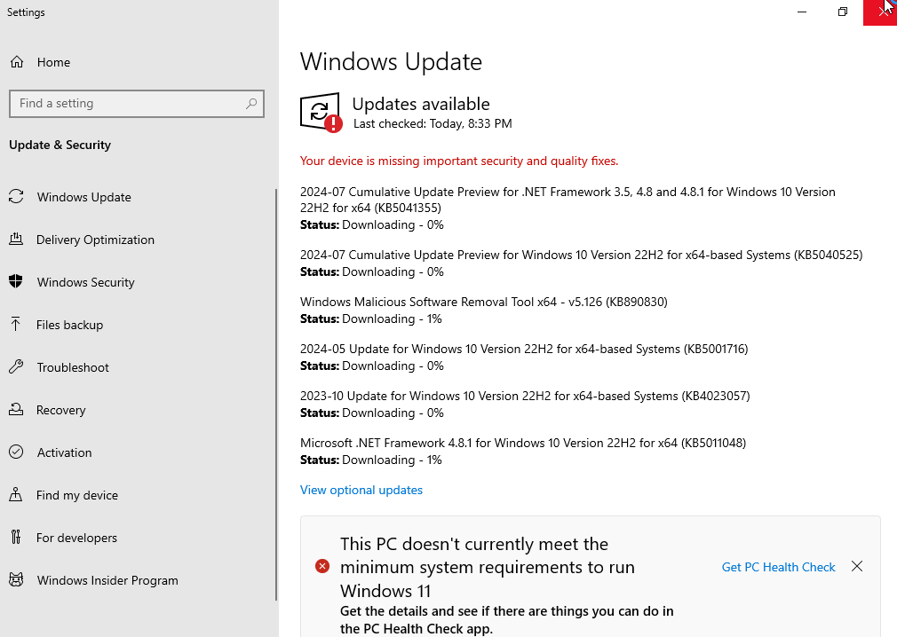

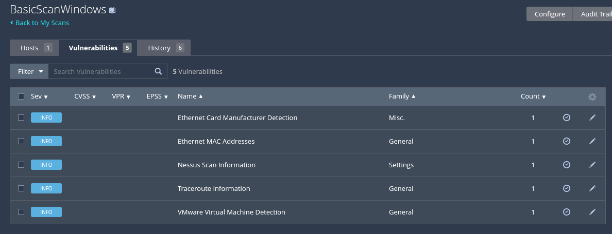

We were able to remediate all of the vulnerabilities that were listed previously. The only things remaining on Nessus is the information regarding the system that was collected during the scan.

## Conclusion
Nessus is a great tool to scan your systems for any vulnerabilities that may exist. Not only does it do an incredible job of finding these vulnerabilities, but it also conveniently sorts them by criticallity, through CVSS, so that you can get to the most important vulnerabilities first. The description of each vulnerability is useful in understanding how the attacker can possibly leverage it, and also allows for further research through the listing of documentation below. Remediation is also greatly eased through the remediation section, which gives you possible remediation steps to patch the vulnerabilities.
Cybersecurity is a field that is constantly changing, and there are numerous vulnerabilities and attack vectors that are discovered each and every day. It is important to keep not only your systems updated, but your software as well. Tools such as Nessus can assist us in discovering these vulnerabilities that may reside on our systems, and help us to remediate them easily, so that we may avoid attacks and mitigate risk. For many, Nessus is not a commonly used tool, but it is a great lesson to show that a good habit of to keeping your system updated will greatly reduce the attack vector of your system.
